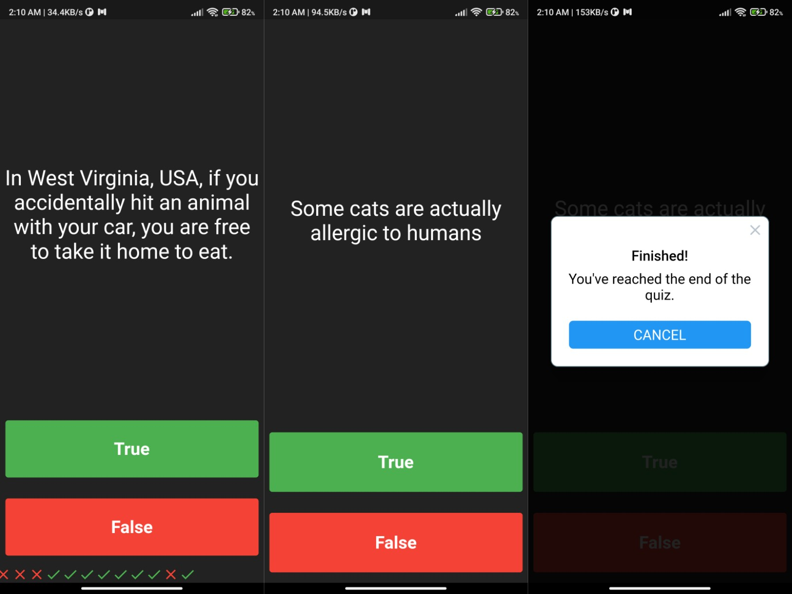

# Quiz App
A simple quiz app built with Flutter.

## Introduction
A Flutter application that allows users to take a quiz by answering true or false questions. The app presents a series of questions and provides immediate feedback on the user's response. Once the user completes the quiz, a completion alert is displayed, and the user can restart the quiz.

## Features
- Multiple true/false questions
- Immediate feedback on user's response
- Completion alert with the final score
- Restart quiz option

## Screenshots

## Dependencies
- `flutter/material.dart`: Material design components for building the user interface.
- `rflutter_alert`: A Flutter package for showing customizable alerts and dialogs.

## How to Use
1. Launch the Quizzler app on your device or emulator.
2. Read the question displayed on the screen.
3. Choose either "True" or "False" as your answer by tapping the respective button.
4. Receive immediate feedback on your answer with an icon (✔️ for correct, ❌ for incorrect).
5. Repeat steps 2-4 until you have answered all the questions.
6. When you complete the quiz, an alert will be displayed showing your final score.
7. To restart the quiz, tap the "Restart" button on the alert dialog.

## Code Structure
The project structure is as follows:    
  - `lib/`: Contains the Dart code for the Quizzler app.
  - `main.dart`: Entry point of the application.
  - `quiz_brain.dart`: Manages the quiz questions and provides methods to retrieve and check answers.
  - `quiz_page.dart`: Contains the UI code for the quiz page.
  - `question.dart`: Defines the Questions class to represent a quiz question.

## Acknowledgments
- This app was built as part of the Flutter Development Bootcamp by The App Brewery.
